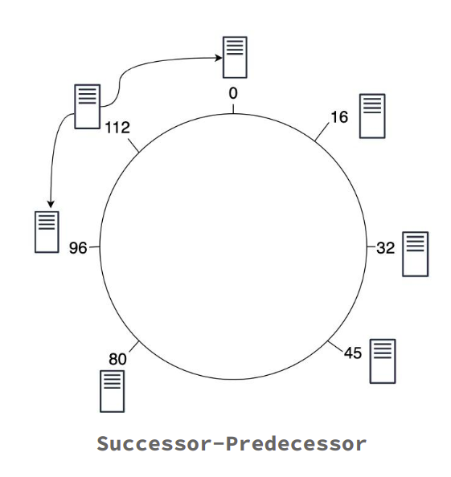

# Chord Protocol - Distributed Hash Table

A Python implementation of the Chord protocol for distributed hash tables. This project demonstrates a scalable peer-to-peer lookup service with O(log N) routing complexity.

## 🚀 Features

- **Distributed Hash Table**: Scalable key-value storage across multiple nodes
- **O(log N) Lookup**: Efficient routing using finger tables
- **Automatic Stabilization**: Self-healing network with fault tolerance
- **Concurrent Operations**: Thread-safe operations with proper synchronization
- **Interactive Client**: Menu-driven interface for DHT operations

## 📋 Architecture

The system consists of two main components:

- **Node_DHT.py**: DHT node implementation with finger table routing
- **Client.py**: Interactive client for performing DHT operations

### Key Concepts

- **Finger Table**: Routing table enabling logarithmic lookup complexity
- **Successor/Predecessor**: Ring topology maintenance
- **Stabilization Protocol**: Background process ensuring network consistency




## 📦 Installation

### Prerequisites
- Python 3.6+
- No external dependencies required

### Setup
```bash
git clone https://github.com/harshitbhatt18/ChordDHT.git
```

## 🎯 Quick Start

### Option 1: Automated Testing
**Linux/macOS:**
```bash
bash test.sh
```

**Windows:**
```batch
test.bat
```

### Option 2: Manual Setup
1. **Start first node (creates ring):**
   ```bash
   python3 Node_DHT.py 9000
   ```

2. **Add more nodes:**
   ```bash
   python3 Node_DHT.py 9001 9000
   python3 Node_DHT.py 9002 9000
   ```

3. **Run client:**
   ```bash
   python3 Client.py
   ```

## 🔧 Usage

### Node Operations
- **Create ring**: `python3 Node_DHT.py <port>`
- **Join ring**: `python3 Node_DHT.py <new_port> <existing_port>`

### Client Operations
- **Insert**: Store key-value pairs
- **Search**: Retrieve values by key
- **Delete**: Remove key-value pairs

## 📁 Project Structure
```
chord-protocol/
├── Node_DHT.py         # Main DHT node implementation
├── Client.py           # Interactive client interface
├── test.sh             # Test script (Linux/macOS)
├── test.bat            # Test script (Windows)
├── README.md           # Project documentation
├── requirements.txt    # Dependencies (none required)
└── images/            # Documentation images
```

## 🤝 Contributing

1. Fork the repository
2. Create a feature branch (`git checkout -b feature/amazing-feature`)
3. Commit your changes (`git commit -m 'Add some amazing feature'`)
4. Push to the branch (`git push origin feature/amazing-feature`)
5. Open a Pull Request

## 📄 License

This project is licensed under the MIT License - see the [LICENSE](LICENSE) file for details.